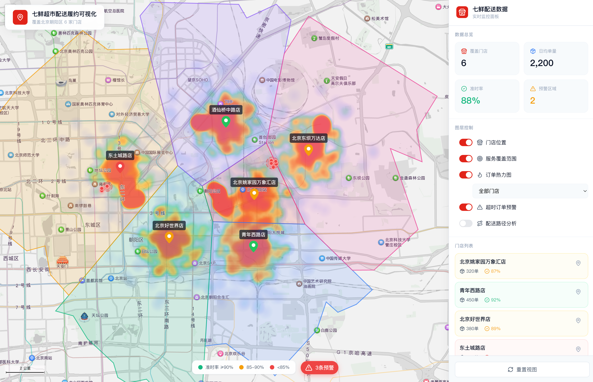

# 七鲜超市配送履约可视化工具

> 🗺️ 基于地图可视化的即时零售配送分析平台

**在线演示：** [https://7freshmap.jason12138.com/](https://7freshmap.jason12138.com/)

---

## 📖 项目简介

本项目是一个针对京东七鲜超市配送业务的可视化分析工具，旨在通过地图可视化直观展示配送问题，用科学方法划分门店服务范围，用数据支撑调度决策。

### 解决的业务痛点

- **超时区域识别难** → 无法针对性优化配送策略
- **服务范围划定随意** → 门店覆盖重叠或存在空白区域
- **运力分配不合理** → 高峰期容易爆单

---

## ✨ 核心功能

### 1. 门店位置标记

在地图上展示6家七鲜门店位置及核心数据：

- **悬停显示**：门店名称、日均单量、准时率
- **点击显示**：详细信息卡片（地址、平均配送时长、超时订单数等）
- **交互操作**：
  - 侧边栏点击门店 → 地图自动定位并缩放
  - 点击地图门店图标 → 弹出详情卡片
  - 双击门店 → 聚焦并显示该门店的服务范围

### 2. 服务范围可视化（泰森多边形）

使用30分钟骑行等时圈+泰森多边形算法科学划分每个门店的服务范围：

- **算法原理**：基于最近邻原则，任何订单坐标都分配给离它最近的门店
- **边界约束**：结合30分钟骑行等时圈作为边界
- **可视化效果**：
  - 不同门店用不同颜色半透明填充
  - 点击某区域高亮显示并展示统计信息（覆盖面积、日均单量）

### 3. 订单热力图

展示订单在地理空间的分布密度：

- **颜色编码**：蓝色（低密度）→ 黄色（中密度）→ 红色（高密度）
- **业务价值**：
  - 识别订单热点区域（需要重点保障运力）
  - 对比不同门店的订单分布特征
  - 发现潜在的服务空白区

### 4. 超时订单预警

在地图上标记超时订单位置，识别"配送黑洞"：

- **超时定义**：实际配送时长 > 30分钟
- **可视化**：红色圆点标记超时订单
- **聚集识别**：500米内超时订单 > 5单时，用红色区域高亮标记
- **超时原因分类**：距离过远、小区门禁、电梯等待、地库难找等

### 5. 配送路径对比

对比骑手实际路径与优化路径，发现效率提升空间：

- **蓝色虚线**：骑手实际路径
- **绿色实线**：推荐优化路径
- **优化算法**：贪心算法（TSP问题简化版）
- **业务价值**：量化优化空间，支持骑手培训

### 6. 数据面板与洞察建议

- **数据总览**：覆盖门店数、日均单量、准时率、预警区域数
- **图层控制**：可独立开关各可视化图层
- **门店列表**：快速定位和查看各门店数据
- **智能洞察**：
  - 异常预警（超时率过高的区域）
  - 优化建议（服务范围重叠、路径优化空间）
  - 表现优异（准时率高的门店经验推广）

---

## 📊 数据说明

当前使用模拟数据：
- 订单分布遵循距离衰减模型（离门店越近订单越多）
- 门店数据基于北京地区6家七鲜超市

---

## 📄 许可证

**版权所有 © 2026**

本项目仅供个人学习和作品展示使用。
如需使用本项目，请联系作者获取授权。